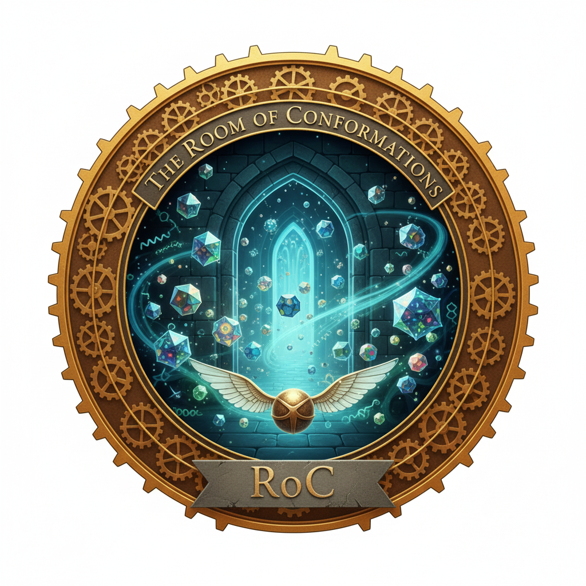
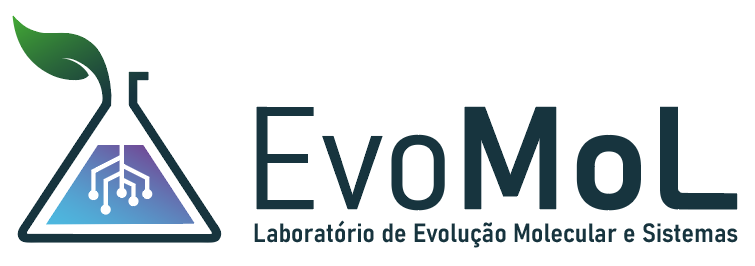
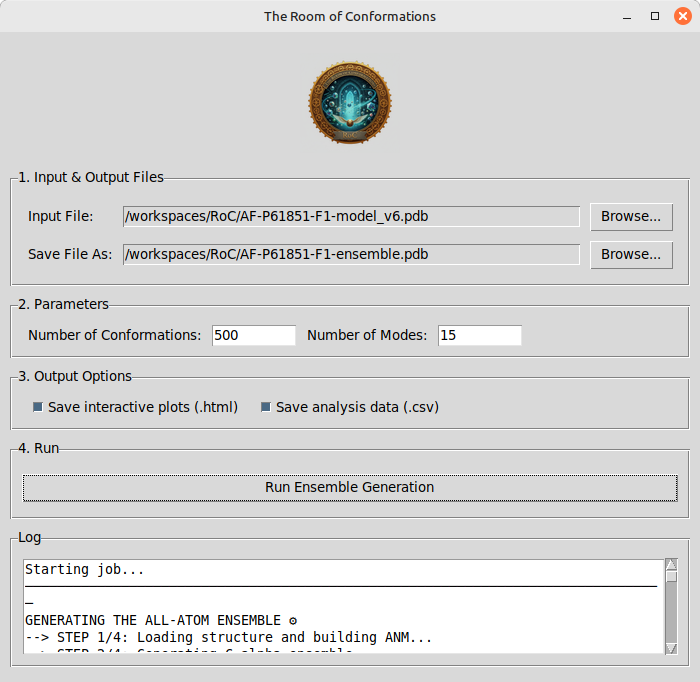
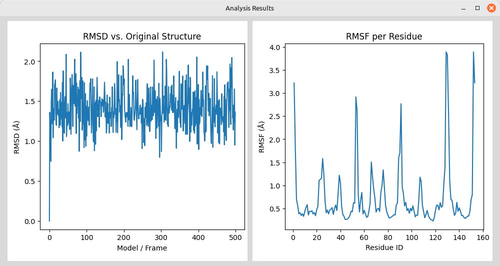

<div align="center">



</div>

# The Room of Conformations

A user-friendly desktop tool for generating all-atom protein conformational ensembles using Normal Mode Analysis.

**The Room of Conformations (RoC)** is a standalone application designed to make protein dynamics analysis accessible to everyone. It uses the power of [**ProDy**](http://www.bahargroup.org/prody/ "null") and [**MDAnalysis**](https://www.mdanalysis.org/ "null") to calculate and reconstruct plausible protein movements, all wrapped in a simple graphical user interface.

No command-line expertise, Python installation, or server access is required. Just download, click, and run.

<div>



</div>

Developed by the EvoMol-Lab - [BioME](http://bioinfo.imd.ufrn.br) - [UFRN](https://ufrn.br/en).

## Key Features

- **Simple Graphical Interface:** No more complex scripts. Just point, click, and generate.

- **Standalone Executable:** No need to install Python or any dependencies. Everything is bundled together.

- **Cross-Platform:** Works on Linux, Windows, and macOS.

- **All-Atom Ensembles:** Generates high-quality, all-atom ensembles while preserving local secondary structures.

- **Automatic Analysis:** Instantly calculates and displays interactive RMSD and RMSF plots for your generated ensemble.

- **Local Processing:** All calculations run on your own machine, ensuring your data remains private and secure.

## Screenshots

**Main Window:**


**Plots visualization:**


## How to Use (Installation-Free)

1. **Download:** Go to the [**Releases**](https://www.google.com/search?q=https://github.com/your-username/your-repo/releases "null") page of this repository.

2. **Select Your OS:** Download the appropriate file for your operating system (e.g., `RoomOfConformations_Linux.zip`, `RoomOfConformations_Windows.zip`, or `RoomOfConformations_macOS.zip`).

3. **Unzip & Run:**
   
   - **Windows:** Unzip the file and double-click `RoomOfConformations.exe`.
   
   - **macOS:** Unzip the file and double-click the `RoomOfConformations.app`. You may need to right-click > "Open" the first time to approve the application.
   
   - **Linux:** Unzip the file, open a terminal, navigate to the folder, make the file executable with `chmod +x RoomOfConformations`, and run it with `./RoomOfConformations`.

4. **Using the App:**
   
   - Click **"Browse..."** to select your input PDB file.
   
   - Click the second **"Browse..."** to choose a name and location for your output ensemble file.
   
   - Adjust the **Number of Conformations** and **Number of Modes** as needed.

   - If desired, check the options to save interactive Plotly plots in html files and `.csv` files with the RMSD and RMSF data.
   
   - Click **"Run Ensemble Generation"**. The analysis will start, and you can monitor the progress in the log window.
   
   - Once complete, interactive plots for RMSD and RMSF will open in another window, and the final PDB ensemble file will be saved to your chosen location.

## How It Works

The application follows a robust hybrid workflow to generate the ensemble:

1. **Coarse-Graining (ProDy):** An Anisotropic Network Model (ANM) is built using only the Cα atoms of your protein. This allows for the efficient calculation of low-frequency normal modes, which represent large-scale, collective protein motions.

2. **Sampling (ProDy):** A Cα-only ensemble is generated by creating new structures through random displacements along the softest normal modes.

3. **Reconstruction (MDAnalysis):** For each conformation in the Cα ensemble, the full all-atom structure is rigidly superimposed onto the new Cα positions. This robustly reconstructs the detailed atomic model while preserving the original bond lengths, angles, and secondary structures.

4. **Output:** A multi-model PDB file containing the final all-atom ensemble is written, ready for visualization or further analysis.

## For Developers (Building from Source)

If you wish to modify the code or build the executable yourself, follow these steps.

**1. Prerequisites:**

- Python 3.9+

**2. Setup a Virtual Environment:**

```
# Create a virtual environment
python3 -m venv venv

# Activate it
# On Linux/macOS:
source venv/bin/activate
# On Windows:
.\venv\Scripts\activate
```

**3. Install Dependencies:**

```
pip install prody MDAnalysis plotly Pillow pyinstaller
```

**4. Run the App from Source:**

```
python RoomOfConformations.py
```

5. Build the Standalone Executable:

Make sure RoomOfConformations.py and RoC-Logo.png are in your directory.

- **On Linux / macOS:**
  
  ```
  pyinstaller --onefile --windowed --add-data "RoC-Logo.png:." RoomOfConformations.py
  ```

- **On Windows:**
  
  ```
  pyinstaller --onefile --windowed --add-data "RoC-Logo.png;." RoomOfConformations.py
  ```

The final executable will be located in the `dist/` folder.

## Citing

If you use **The Room of Conformations** in your published research, please cite this repository.

Furthermore, please remember to cite the essential underlying libraries that make this tool possible:

- **ProDy:**
  
  > Bakan, A, Meireles, LM, Bahar, I. (2011) ProDy: Protein Dynamics Inferred from Theory and Experiments. *Bioinformatics* 27(11):1575-1577.

- **MDAnalysis:**
  
  > R. J. Gowers, M. Linke, J. Barnoud, T. J. E. Reddy, M. N. Melo, S. L. Seyler, D. L. Dotson, J. Domanski, S. Buchoux, I. M. Kenney, and O. Beckstein. MDAnalysis: A Python package for the rapid analysis of molecular dynamics simulations. In S. Benthall and S. Rostrup, editors, *Proceedings of the 15th Python in Science Conference*, pages 98-105, Austin, TX, 2016. SciPy.

## License

This project is licensed under the MIT License - see the [LICENSE](LICENSE.txt) file for details.

## Third-Party Library Acknowledgements

This application is built using several fantastic open-source libraries. In accordance with their licenses, we are providing their original copyright notices here.

#### ProDy

- **License:** MIT License

- **Copyright:** (c) 2010-2022, ProDy Development Team

The MIT License (MIT)

Copyright (c) 2010-2022, ProDy Development Team

Permission is hereby granted, free of charge, to any person obtaining a copy of this software and associated documentation files (the "Software"), to deal in the Software without restriction, including without limitation the rights to use, copy, modify, merge, publish, distribute, sublicense, and/or sell copies of the Software, and to permit persons to whom the Software is furnished to do so, subject to the following conditions:

The above copyright notice and this permission notice shall be included in all copies or substantial portions of the Software.

#### MDAnalysis

- **License:** GNU Lesser General Public License v2.1 (LGPL-2.1)

- **Copyright:** (c) 2008-2022, MDAnalysis Development Team

MDAnalysis is free software; you can redistribute it and/or modify it under the terms of the GNU Lesser General Public License as published by the Free Software Foundation; either version 2.1 of the License, or (at your option) any later version.

This library is distributed in the hope that it will be useful, but WITHOUT ANY WARRANTY; without even the implied warranty of MERCHANTABILITY or FITNESS FOR A PARTICULAR PURPOSE. See the GNU Lesser General Public License for more details.

#### Plotly

- **License:** MIT License

- **Copyright:** (c) 2022 Plotly, Inc.

The MIT License (MIT)

Copyright (c) 2022 Plotly, Inc.

Permission is hereby granted, free of charge, to any person obtaining a copy of this software and associated documentation files (the "Software"), to deal in the Software without restriction, including without limitation the rights to use, copy, modify, merge, publish, distribute, sublicense, and/or sell copies of the Software, and to permit persons to whom the Software is furnished to do so, subject to the following conditions:

The above copyright notice and this permission notice shall be included in all copies or substantial portions of the Software.

#### Pillow (PIL Fork)

- **License:** Historical Permission Notice and Disclaimer (HPND)

- **Copyright:** (c) 1997-2011 by Secret Labs AB, (c) 1995-2011 by Fredrik Lundh

The Python Imaging Library (PIL) is

Copyright © 1997-2011 by Secret Labs AB

Copyright © 1995-2011 by Fredrik Lundh

By obtaining, using, and/or copying this software and/or its associated documentation, you agree that you have read, understood, and will comply with the following terms and conditions:

Permission to use, copy, modify, and distribute this software and its associated documentation for any purpose and without fee is hereby granted, provided that the above copyright notice appears in all copies, and that both that copyright notice and this permission notice appear in supporting documentation, and that the name of Secret Labs AB or the author not be used in advertising or publicity pertaining to distribution of the software without specific, written prior permission.

#### PyInstaller

- **License:** GNU General Public License v2.0 (GPL-2.0) with a special "bootloader exception".

- **Copyright:** (c) 2013-2022, PyInstaller Development Team.

PyInstaller is licensed under the GPL license, but with a special exception that allows you to distribute your bundled application under your own license. The programs created by PyInstaller are not considered derivative works of PyInstaller.