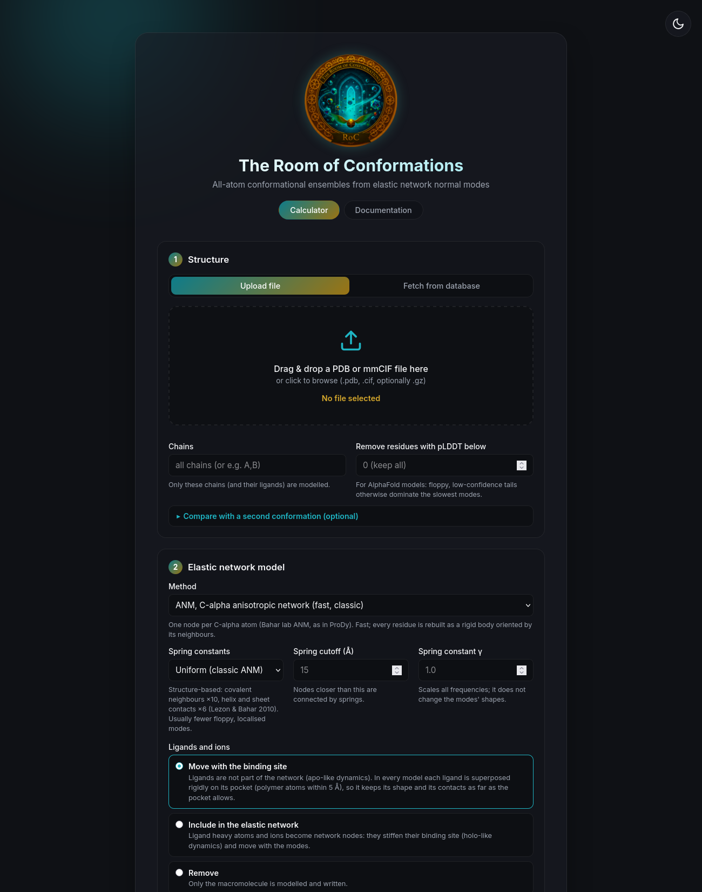
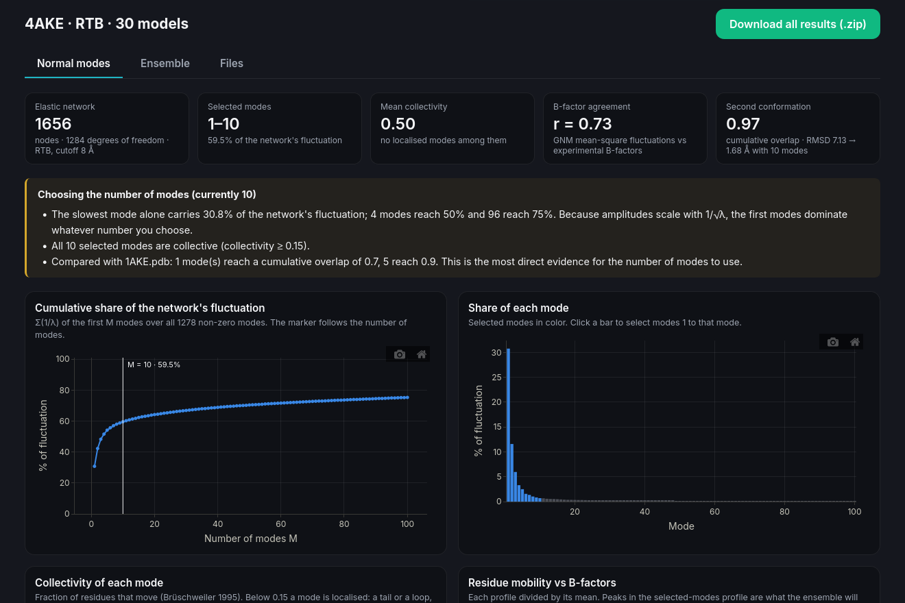
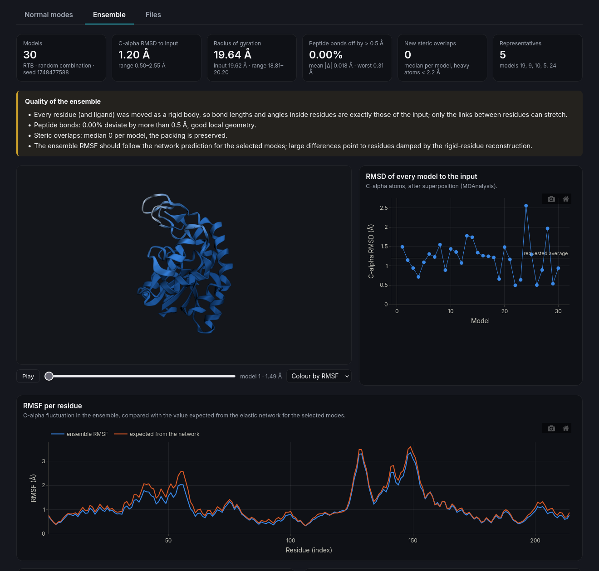

<div align="center">


</div>

# The Room of Conformations

All-atom protein conformational ensembles from elastic network normal modes, in a local web
interface.

**The Room of Conformations (RoC)** generates plausible conformations of a protein, and of its
ligands, by moving it along its softest collective motions. It uses [**ProDy**](http://www.bahargroup.org/prody/)
for the elastic network models and [**MDAnalysis**](https://www.mdanalysis.org/) for the analysis,
and it explains its choices: how many modes to use, what each mode does, and how good the
resulting models are. It is a local, open replacement for web servers such as
[NMSim](https://doi.org/10.1093/nar/gks478): your structures never leave your computer.

<div>


</div>

Developed by the EvoMol-Lab - [BioME](http://bioinfo.imd.ufrn.br) - [UFRN](https://ufrn.br/en).

## What's new in 2.0.0

The **Room of Conformations** has a new web interface!

**- Web interface** (Flask, in the style of [Sauron](https://github.com/evomol-lab/Sauron)) with progress, cancellation, interactive charts, and 3D viewers (3Dmol.js), plus a command line.
**- Correct all-atom reconstruction.** RoC 1.x moved only the C-alpha atoms; all other atoms stayed at their input positions, so backbone bonds stretched by several Å (N–CA up to 7.7 Å in the example ensemble). Every residue is now moved as a rigid body; regenerate ensembles made with 1.x.
**- Three network models:** C-alpha ANM (uniform or structure-based springs), RTB with rigid residues or secondary-structure blocks on all heavy atoms, and ProDy's ClustENM with OpenMM energy minimization (optional). GNM checks the network against B-factors and finds hinges.
**- Help with the number of modes:** share of the fluctuation, collectivity of each mode, mobility profiles, a mode explorer that animates every mode, and, given a second conformation of the same protein, the overlap of the modes with the real conformational change.
**- Ligands and ions are recognized**, listed with their pockets, and either follow their binding site, become part of the network, or are removed. The system handles mmCIF input, ions named CA, insertion codes, modified residues, nucleic acids, and multi-model files.
**-Quality report and analysis:** peptide-bond deviations, new steric overlaps, RMSD, RMSF, radius of gyration, pairwise RMSD with cluster representatives, Ramachandran plot.

## Screenshots

**Input and parameters**


**Choosing the number of modes**


**Ensemble and quality report**


## Installation and use

**1. Install** (Python 3.10 or newer):

```
python3 -m venv .venv
source .venv/bin/activate          # Windows: .venv\Scripts\activate
pip install -r requirements.txt
pip install openmm pdbfixer        # optional, only for the ClustENM method
```

or, with conda:

```
conda create -n roc -c conda-forge python=3.12 pip
conda activate roc
pip install -r requirements.txt openmm pdbfixer
```

Use a dedicated environment: installing the pinned NumPy/SciPy with pip into the Anaconda
`base` environment mixes pip and conda builds and can break other packages (e.g. h5py).

**2. Run the web interface:**

```
python RoCGUI.py
```

and open <http://127.0.0.1:5050>. Upload a structure (or fetch it from the PDB or AlphaFold DB),
click **Analyze modes** to choose the number of modes, then **Generate ensemble**. Everything is
explained in the **Documentation** tab ([DOCUMENTATION.md](DOCUMENTATION.md)).

**Command line:**

```
python roc.py structure.pdb --outdir results --method rtb --modes 10 --confs 100 --rmsd 1.0
python roc.py apo.pdb --outdir results --analyze-only --target holo.pdb
python roc.py --help
```

**Containers:**

```
podman build -t roc .                      # or docker build
podman run --rm -p 5050:5050 roc           # web interface on http://localhost:5050
apptainer build roc.sif Apptainer.def
```

**Google Colab:** you can also use our Google Colab notebook
[HERE](https://colab.research.google.com/drive/1jd3qgAZPF9bWxlcCjYURpFQAEYW102Y5?usp=sharing).

## How it works

1. **Network (ProDy).** The structure is read (PDB or mmCIF), waters are removed and every residue
   is classified. An elastic network is built: one node per C-alpha atom (ANM) or all heavy atoms
   with rigid residues or secondary-structure blocks (RTB). Its normal modes are computed.
2. **Modes.** The modes are described (share of the fluctuation, collectivity, B-factor agreement,
   hinges, overlap with a second conformation) to choose how many to use.
3. **Sampling.** Each conformation is a random combination of the slowest *M* modes with amplitudes
   proportional to 1/√λ (as in NMSim and ProDy's `sampleModes`), scaled to the requested average
   C-alpha RMSD. Alternatively each mode can be traversed on its own.
4. **Reconstruction.** Every residue, ligand and ion is moved as a rigid body fitted to its displaced
   network nodes, so the geometry inside residues and ligands is preserved.
5. **Analysis (MDAnalysis).** RMSD, RMSF, radius of gyration, pairwise RMSD and representatives,
   Ramachandran angles, peptide-bond and steric-overlap checks.

### How many modes?

The number of modes does **not** set how much the protein moves (the RMSD does); it sets how many
directions the motion is spread over. Because amplitudes scale with 1/√λ, the slowest modes
dominate. 1–3 modes give the dominant global motions, 5–20 the usual collective space for ensembles
(default 15), more modes add local fluctuations. **Analyze modes** shows the evidence for your
structure; with a second conformation (e.g. apo and holo forms) it shows directly how many modes
the real change needs. For adenylate kinase (4AKE → 1AKE), mode 1 alone has an overlap of 0.80
with the closure and 10 modes reach 0.97. Details in [DOCUMENTATION.md](DOCUMENTATION.md#how-many-modes).

## Building a standalone executable

```
pip install pyinstaller
pyinstaller RoCGUI.spec
```

The executable is written to `dist/`; it starts the server and opens the browser. The ClustENM
method is not bundled (it needs OpenMM). Publish executables as GitHub releases rather than
committing them (`build/` and `dist/` are ignored by git).

The previous desktop application (Tkinter, RoC 1.x) was removed in 2.0 because of the
reconstruction problem described above; it remains in the git history.

## Citing

If you use **The Room of Conformations** in your published research, please cite this repository.

Please also cite the libraries and methods that make it possible:

- **ProDy:** Bakan A, Meireles LM, Bahar I (2011) ProDy: protein dynamics inferred from theory and
  experiments. *Bioinformatics* 27:1575–1577; Zhang S *et al.* (2021) ProDy 2.0. *Bioinformatics*
  37:3657–3659.
- **MDAnalysis:** Michaud-Agrawal N, Denning EJ, Woolf TB, Beckstein O (2011) *J Comput Chem*
  32:2319–2327; Gowers RJ *et al.* (2016) *Proc 15th Python in Science Conf*, 98–105.
- **ANM:** Atilgan AR *et al.* (2001) *Biophys J* 80:505–515. **RTB:** Tama F *et al.* (2000)
  *Proteins* 41:1–7. **ClustENM:** Kurkcuoglu Z, Bahar I, Doruker P (2016) *J Chem Theory Comput*
  12:4549–4562.

The full list of references is in [DOCUMENTATION.md](DOCUMENTATION.md#references).

## License

This project is licensed under the MIT License - see the [LICENSE](LICENSE.txt) file for details.
Third-party libraries and their licenses are listed in
[THIRD_PARTY_LICENSES.md](THIRD_PARTY_LICENSES.md).
